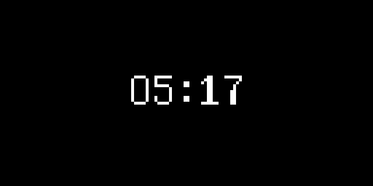
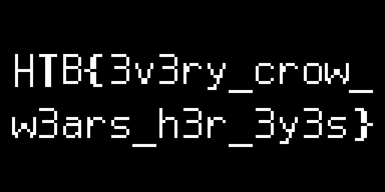

# What the Shard Displayed — Writeup

**Category:** Hardware / Forensics (Logic Analyzer capture)
**File provided:** `capture.sr`

## TL;DR

The provided file is a [sigrok](https://sigrok.org/) logic-analyzer capture of an
**I2C bus** (2 MHz sample rate, 2 active channels) between a microcontroller and
an **SSD1306 OLED display** at address `0x3C`. Replaying the captured writes to
the display's GDDRAM and rendering the resulting framebuffer reveals a short
loading animation followed by a frame containing the flag, rendered as pixel text
on the "screen":

```
HTB{3v3ry_crow_w3ars_h3r_3y3s}
```

---

## 1. Identifying the capture

`capture.sr` is itself a zip archive (sigrok's session format):

```
$ file capture.sr
capture.sr: Zip archive data, at least v2.0 to extract, compression method=store

$ unzip -l capture.sr
  version
  metadata
  logic-1-1 ... logic-1-196     (198 files total)
```

`metadata` tells us how to interpret the raw sample chunks:

```ini
[device 1]
capturefile=logic-1
total probes=8
samplerate=2 MHz
unitsize=1
probe1=D0
probe2=D1
```

Only two probes (`D0`, `D1`) are named/active; each captured byte packs 8 logic
channels, one per bit. Concatenating `logic-1-1` through `logic-1-196` **in
numeric order** (not lexicographic!) reconstructs one continuous 4,000,000-sample
capture — 2 seconds of bus activity at 2 MHz.

## 2. Spotting the protocol

Extracting bit 0 (`D0`) and bit 1 (`D1`) from the combined sample stream and
looking for the first activity:

```python
data = open('combined.bin','rb').read()
d0 = [(b>>0)&1 for b in data]
d1 = [(b>>1)&1 for b in data]
for i,(a,b) in enumerate(zip(d0,d1)):
    if a==0 or b==0:
        print('first low at', i, a, b)
        break
# -> first low at 1962470, d0=1, d1=0
```

`D1` drops low while `D0` stays high — a classic **I2C START condition**
(SDA falls while SCL is high). `D0` then toggles at a steady ~83 kHz rate
(clock), while `D1` changes more sparsely and only while `D0` is low (data).
So: **D0 = SCL, D1 = SDA.**

## 3. Decoding with sigrok-cli

Rather than hand-roll an I2C decoder, `sigrok-cli` ships with a stock `i2c`
protocol decoder:

```bash
apt-get install -y sigrok-cli
sigrok-cli -i capture.sr -P i2c:scl=D0:sda=D1 -A i2c > i2c_decode.txt
```

The very first transaction gives it away immediately:

```
i2c-1: Start
i2c-1: Write
i2c-1: Address write: 3C
i2c-1: ACK
i2c-1: Data write: 00
i2c-1: ACK
i2c-1: Data write: AE   <- Display OFF
i2c-1: Data write: D5   <- Set display clock
i2c-1: Data write: 80
i2c-1: Data write: A8   <- Set MUX ratio
i2c-1: Data write: 3F   <- 0x3F -> 64 rows
...
```

`0x3C` is the standard I2C address for an **SSD1306** OLED controller, and
`AE D5 80 A8 3F D3 00 8D 14 20 00 A1 C8 DA 12 81 CF D9 F1 DB 40 A4 A6 AF` is
its textbook init sequence (display off → clock div → mux ratio → charge pump →
addressing mode → segment/COM remap → contrast → precharge → VCOMH → display
RAM all-on-resume → normal display → **display ON**). A capture of two other
addresses (`0x50` — an EEPROM, `0x68` — an RTC) also appears briefly but is a
red herring; all the interesting data goes to `0x3C`.

Three other addressing commands appear later:

```
21 00 7F   -> Set Column Address: start=0, end=127  (full 128-px width)
22 00 07   -> Set Page Address:  start=0, end=7      (8 pages = 64 px height)
```

This repeats **three times**, each followed by a burst of `0x40`-prefixed
"data write" transactions — `0x40` is the SSD1306 control byte meaning "the
following bytes are GDDRAM data, not commands." Each page/column reset plus
1024 bytes of GDDRAM data (128 columns × 8 pages) corresponds to **one full
128×64 frame** being pushed to the screen. 3 × 1024 = 3072 data bytes total,
matching exactly what's in the capture — **three animation frames**.

## 4. Reconstructing the framebuffer

Parsing `i2c_decode.txt` into Start/Address/Data/Stop transactions and
concatenating every `0x40`-tagged data payload (in bus order) gives the raw
GDDRAM bytes for all three frames back-to-back. The SSD1306, in the addressing
mode set during init (`20 00` = horizontal addressing), lays out memory as
8 "pages" of 128 columns each, where each byte is a **vertical strip of 8
pixels** (bit 0 = top row of the strip):

```python
W, H = 128, 64
for page in range(8):
    for col in range(128):
        byte = frame_bytes[page*128 + col]
        for bit in range(8):
            y = page*8 + bit
            x = col
            pixel[x, y] = (byte >> bit) & 1
```

Rendering each of the 3 frames as a 1-bit PNG:

- **Frame 1** — a stylized eye icon (loading/idle screen):

  

- **Frame 2** — a small "05:17" style readout (timer/animation tick):

  

- **Frame 3** — the payload: two lines of pixel-font text filling the screen:

  

## 5. Reading the text

Frame 3 is small (128×64) and the glyphs are only ~6 px wide with a proportional
font, so straightforward OCR (`tesseract`) got close but garbled a few
characters (confusing `3`/`e`, `w`/`vv`, etc.). To get an exact transcription,
each character was isolated by finding column-runs with no lit pixels
(letter-spacing gaps) and each resulting 6–8px-wide glyph bitmap was read by eye
against the standard blocky pixel font used throughout (matching glyph shapes
for `H`, `T`, `B`, `{`, `3`, `v`, `r`, `y`, `a`, `s`, `h`, `o`, `w`, `}`, etc. by
comparing repeated letters across the frame — e.g. the same "r" glyph shape
recurs in `3v3ry`, `crow`, and `h3r`, confirming the reading is self-consistent).

Line 1 (with a trailing underscore that wraps to line 2):

```
HTB{3v3ry_crow_
```

Line 2:

```
w3ars_h3r_3y3s}
```

Concatenated:

```
HTB{3v3ry_crow_w3ars_h3r_3y3s}
```

— a leetspeak (3 = e) rendering of **"every crow wears her eyes."**

## 6. Flag

```
HTB{3v3ry_crow_w3ars_h3r_3y3s}
```

## Root cause / takeaway summary

| | |
|---|---|
| **Artifact** | `capture.sr` — a sigrok logic-analyzer session, 2 channels @ 2 MHz. |
| **Bus** | I2C, `D0` = SCL, `D1` = SDA. |
| **Target device** | SSD1306 128×64 OLED controller at address `0x3C`. |
| **Key insight** | The flag was never stored as a string in the capture — it only exists as pixel data drawn to a display's GDDRAM. Recovering it required reassembling the I2C transaction stream into command vs. data bytes, replaying the SSD1306 addressing model (pages × columns × vertical bit-strips), and rendering the result as an image. |
| **Tooling** | `sigrok-cli` (I2C decoder), Python (transaction parsing + framebuffer rendering via Pillow), `tesseract` (sanity-check OCR). |
