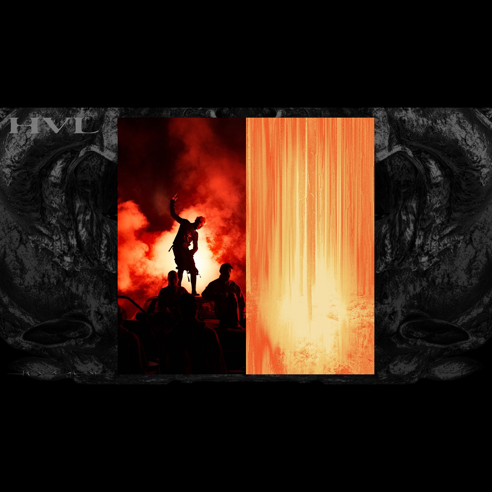

# HVL — v1t CTF 2026

**Category:** Web / Misc  
**Points:** 100  
**Solves:** 78  
**Flag:** `v1t{g04t_mck_hvl}`

> *"MCKeyyyyyy. You can listen the full album here: [youtube playlist](https://www.youtube.com/playlist?list=PLG5bpInXG8Sc) — Note this is a troll challenge don't spend too much time on it"*  
> Challenge URL: https://hvl.v1t.site

---

## Overview

The challenge provides an MP3 file (`kDC9T3kG.mp3`) and links to `hvl.v1t.site`. The flag is hidden across two layers: a broken PNG embedded inside the MP3, and invisible Unicode characters inside a music visualizer webpage.

---

## Step 1: MP3 → Broken PNG

```
exiftool kDC9T3kG.mp3
```

Output reveals an embedded cover image extracted as `picture.png`. Opening it fails — the file header is corrupt.

```
xxd picture.png | head -5
```

```
00000000: 3133 2e35 306b 4443 3954 336b 472e 6d70  13.50kDC9T3kG.mp
...
000000d5: 89 50 4e 47 0d 0a 1a 0a ...              .PNG....
```

The real PNG magic bytes (`89 50 4e 47`) start at offset **213**. The prepended garbage is exiftool's own metadata output — the troll.

```
dd if=picture.png of=fixed.png bs=1 skip=213
file fixed.png
# fixed.png: PNG image data, 1280x1280, 8-bit/color RGB
```



The fixed image is the HVL album cover. Checking for trailer data:

```
exiftool fixed.png
# Warning: [minor] Trailer data after PNG IEND chunk
```

```
python3 -c "
data = open('fixed.png','rb').read()
iend = data.rfind(b'IEND')
print(data[iend+8:])
"
# b'255226.612125'
```

`255226.612125` is appended after IEND — a dead end / red herring. The real flag is on the website.

---

## Step 2: hvl.v1t.site — Hidden Unicode in the SRT

The page source contains a JS music visualizer with an embedded SRT subtitle string. The lyrics sync to an MCK song. Lines 33–37 look normal but carry invisible characters:

```
33: ĐÉO CẦN PHẢI GIẢI THÍCH 🔥[invisible]
34: GHÉT XONG LẠI THÍCH ÀKKK? 😀😃😄😁😆[invisible]
35: ĐÉO CẦN PHẢI GIẢI THÍCH 😅😂🤣[invisible]
36: GHÉT XONG LẠI THÍCH ÀKKK? 🥲😊😇[invisible]
37: ĐÉO CẦN PHẢI GIẢI THÍCH 🙂🥲🙃[invisible]
```

The invisible characters are in the **Unicode Variation Selectors Supplement** range (`U+E0100–U+E01EF`). Each character encodes one ASCII byte: `codepoint − 0xE00F0 = ASCII value`.

Extract them in the browser console:

```js
lyricCues.slice(29).forEach((c, i) => {
  const full = c.text + ' ' + (c.sub || '');
  const hidden = [...full].filter(ch => ch.codePointAt(0) > 0xE0000);
  if (hidden.length) console.log('cue', i+30, hidden.map(ch =>
    String.fromCodePoint(ch.codePointAt(0) - 0xE00F0)
  ).join(''));
})
```

Assembled across cues: **`g04t_mck_hvl`**

---

## Step 3: CSS glitch makes it visible

The visualizer's CSS applies a chromatic-aberration glitch to every lyric via `::before`/`::after` pseudo-elements:

```css
.lyric-current::before,
.lyric-current::after {
  content: attr(data-text);   /* includes the hidden chars */
  transform: translateX(±10px);
  clip-path: polygon(...);    /* clips top / bottom half */
  color: var(--magenta) / var(--acid);
}
```

When `data-text` is set to the lyric text (including the hidden Variation Selector chars), the browser renders them as visible glyphs in the offset colour layers — revealing the flag fragments letter by letter as the song plays through the hook section (~1:25–1:35).

---

## Chain Summary

```
kDC9T3kG.mp3
  -> exiftool: embedded PNG (picture.png)
  -> picture.png: 213-byte corrupt header (exiftool metadata prepended)
  -> dd skip=213 -> fixed.png (valid 1280x1280 album cover)
  -> fixed.png IEND trailer: "255226.612125" (red herring)

hvl.v1t.site
  -> page source: embeddedSrt JS string in music visualizer
  -> SRT lines 33–37: Unicode Variation Selectors Supplement chars
     (U+E0100+) hidden after emojis, invisible in normal rendering
  -> decode: codepoint − 0xE00F0 = ASCII
  -> CSS ::before/::after { content: attr(data-text) } renders
     hidden chars visibly in the RGB-split glitch layer during playback
  -> flag fragments assembled across lyric cues: g04t_mck_hvl
```

**Flag:** `v1t{g04t_mck_hvl}`
